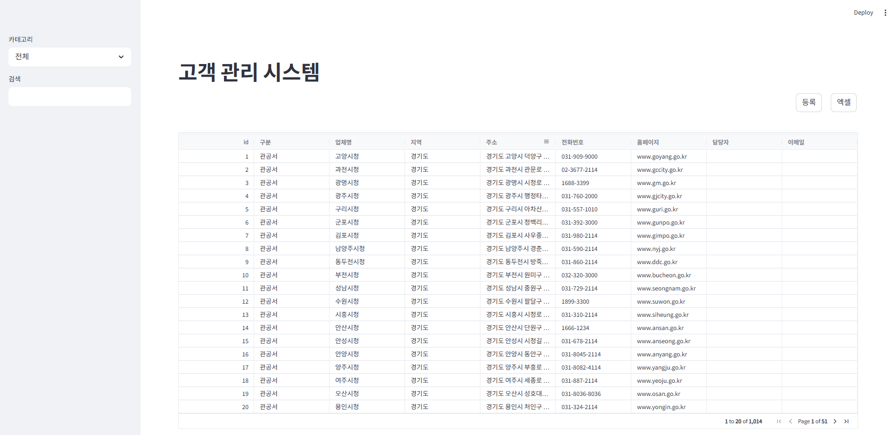
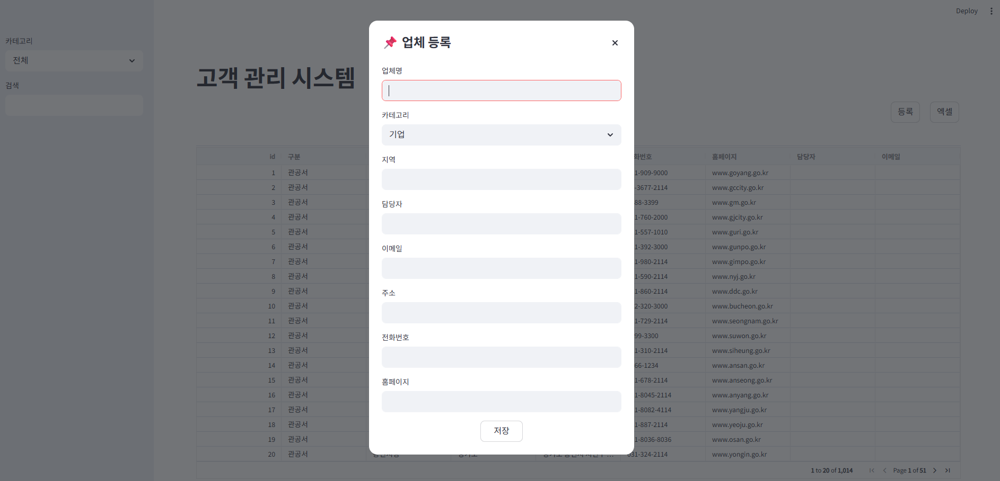
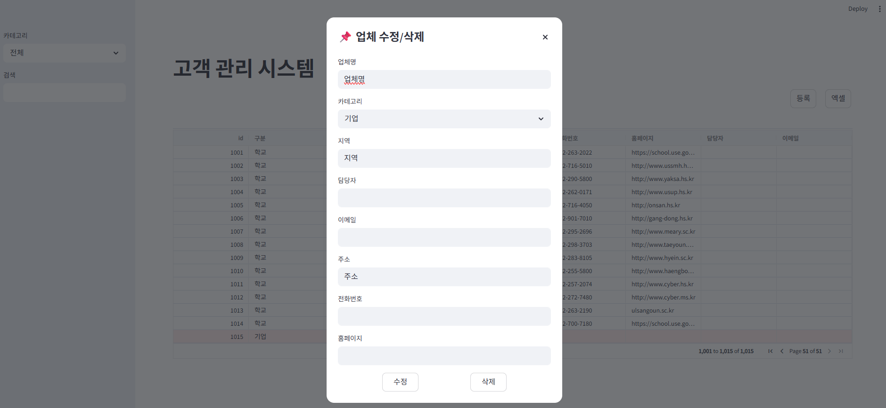

# 📊 고객 관리 시스템 (Company Management System)

FastAPI + Streamlit 기반의 고객(업체) 관리 웹 애플리케이션입니다.
업체 등록, 조회, 수정, 삭제(CRUD) 기능과 함께 엑셀 다운로드 기능을 제공합니다.

---

## 🚀 프로젝트 개요

* 기업 / 학교 / 관공서 등 다양한 고객 데이터를 통합 관리
* 직관적인 UI 기반 데이터 조회 및 수정
* REST API + 프론트엔드 분리 구조

---

## 🛠 기술 스택

### Backend

* FastAPI
* SQLModel (SQLite)
* Uvicorn

### Frontend

* Streamlit
* st-aggrid

### Data & 기타

* Pandas
* OpenPyXL
* Requests

---

## 📁 프로젝트 구조

```
companylist/
│   requirements.txt
│   .gitignore
│
├── backend/
│   ├── main.py
│   ├── load_excel.py
│   ├── db/
│   │   ├── database.py
│   │   ├── init_db.py
│   │   ├── models.py
│   │   └── company.db
│   └── data/
│       └── company.xlsx
│
├── frontend/
│   └── app.py
│
└── venv/
```

---

## ⚙️ 주요 기능

### 📌 업체 관리 (CRUD)

* 업체 등록
* 업체 조회 (전체 / 카테고리별)
* 업체 수정
* 업체 삭제

### 📌 데이터 검색 및 필터링

* 업체명 검색
* 카테고리 필터
* 지역 필터
* 컬럼별 필터 (AgGrid)

### 📌 엑셀 다운로드

* 전체 데이터 Excel 파일로 다운로드
* ID 컬럼 제외

---

## 🖥 실행 방법

### 1️⃣ 가상환경 생성 및 활성화

```bash
python -m venv venv
venv\Scripts\activate
```

### 2️⃣ 패키지 설치

```bash
pip install -r requirements.txt
```

### 3️⃣ DB 초기화

```bash
cd backend
python db/init_db.py
```

### 4️⃣ 서버 실행 (FastAPI)

```bash
uvicorn main:app --reload
```

👉 실행 주소: http://127.0.0.1:8000

### 5️⃣ 프론트 실행 (Streamlit)

```bash
cd ../frontend
streamlit run app.py
```

---

## 📌 API 엔드포인트

| Method | Endpoint              | 설명      |
| ------ | --------------------- | ------- |
| GET    | /companies            | 전체 조회   |
| GET    | /companies/{category} | 카테고리 조회 |
| POST   | /companies            | 업체 등록   |
| PUT    | /companies/{id}       | 업체 수정   |
| DELETE | /companies/{id}       | 업체 삭제   |

---

## 💡 특징

* FastAPI 기반 RESTful API 설계
* Streamlit + AgGrid 기반 인터랙티브 UI
* SQLite 기반 경량 DB 구조
* 검색 + 필터 + 페이지네이션 UI 적용

---

## 📸 화면 예시

### 메인 화면


### 등록 화면


### 수정/삭제 화면


---